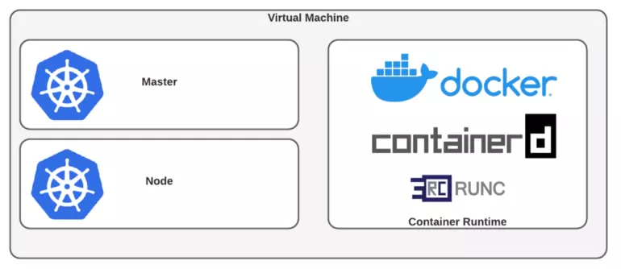

# Create a Kubernetes cluster

In this lab we will cover basic concepts of Kubernetes. We will create a Kubernetes cluster with **Minikube**..

**Minikube** allow us to learn about Kubernetes concepts without having to install Kubernetes on a real cluster. It is a lightweight Kubernetes cluster that is easy to run and is suitable for development and testing.

In this lab, **Minikube** is already installed. To install it in your machine, follow the instructions in the [Minikube Installation Guide](https://minikube.sigs.k8s.io/docs/start/).

Para instalarlo en un entorno Linux, deberemos instalar previamente un hypervisor como  [KVM](http://www.linux-kvm.org/) o [Virtualvox](https://www.virtualbox.org/wiki/Downloads) y el interfaz de línea de comando de Kubernetes: [kubectl](https://kubernetes.io/docs/tasks/tools/install-kubectl/) .  Una vez cumplidos estos requisitos podemos realizar la instalación de Minikube con:

## Running Minikube

Check that **Minikube** is running with the following command:

`minikube version`{{execute}}

And that we have the latest version installed:

`minikube update-check`{{execute}}

We can also find the all the possibilities that we have:

`minikube`{{execute}}

And request extra help:

`minikube config view`{{execute}}

Once **Minikube** is up and running, we can run a single-node cluster:

`minikube start`{{execute}}

If everything was fine, we should have a running Kubernetes cluster in our local machine.

Confirm the Cluster status with:
`minikube status`{{execute}}
