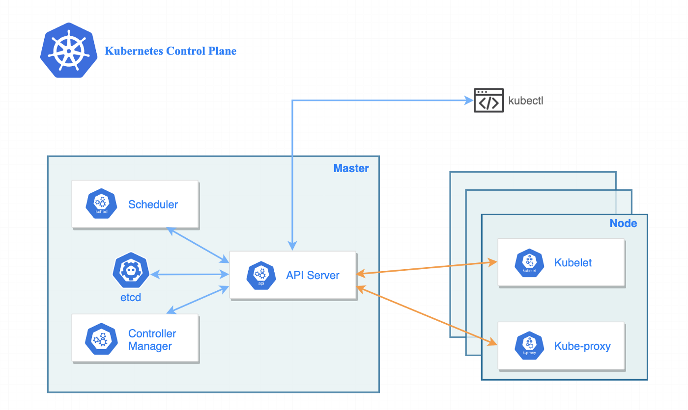

# Discovering our Kubernetes cluster

## Introduction

> A Cluster is a group of two or more computers, or nodes, that run in parallel to achieve a common goal. This allows workloads consisting of a high number of individual, parallelizable tasks to be distributed among the nodes in the cluster. As a result, these tasks can leverage the combined memory and processing power of each computer to increase overall performance.

Once running, we can see the Kubernetes cluster info by running the command *kubectl cluster-info*:

`kubectl cluster-info`{{execute}}

An easy way to get a diagnotic status of the cluster is using:

`kubectl get componentstatuses`{{execute}}

We will see something like this:

```bash
NAME                 STATUS    MESSAGE             ERROR
controller-manager   Healthy   ok
scheduler            Healthy   ok
etcd-0               Healthy   {"health":"true"}
```

We can see here the the components that constitute the Kubernetes cluster.

- **controller-managers** are control loops that continuously watch the state of your cluster, then make or request changes where needed. Each controller tries to move the current cluster state closer to the desired state.
- **scheduler** is the responsible to assign the Pods to the different Nodes in the Cluster.
- **etcd** Is is a consistent and highly-available key value store used as Kubernetes' backing store for all cluster data.



## Kubeconfig

**Kubeconfig** is a file that contains the information needed to connect to a Kubernetes cluster. It containes the information about the cluster, the user, the context and the server. The file is usually stored in `$HOME/.kube/config`. The **kubectl** uses this file to connect to the cluster:

`cat .kube/config`{{execute}}

The default *kubecofig* file location can be changed by setting the `KUBECONFIG` environment variable or using the `--kubeconfig` flag in the *kubectl* command.
