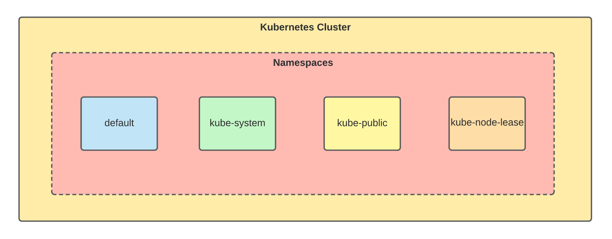

# Undestanding Kubernetes Namespaces

## Introduction

> A Namespace is like a virtual cluster inside Kubernetes. Namespaces provides a mechanism for isolating groups of resources within a single cluster. We can have multiple namespaces in a single cluster and each namespace can have its own resources. These virtual spaces can be used to isolate different projects, teams and users in a single cluster.

We can request the different namespaces from the Kubernetes API server using the command:

`kubectl get namespace`{{execute}}

